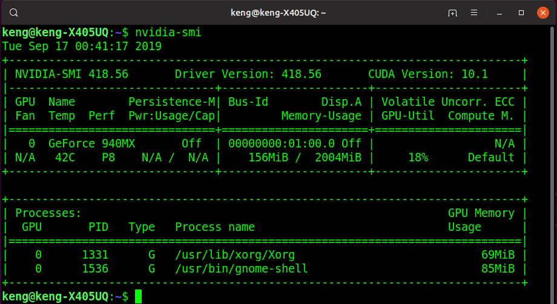

# Tensorflow2.0rc1
Building Tensorflow 2.0 RC 1 from source

## Purpose of Building from source
When a version of tensorflow is released, you can easily do a **pip3 install tensorflow-gpu==2.0.0rc1** to install the latest software. However, there is no source codes required, it's just a module install.  When Source codes of tensorflow is required, for example, the need to access TFliteconverter etc or when you need to have a better understanding of tensorflow codes, you might need to build from source.  However, it is very timeconsuming.  And after many hours, it might fail on some conditions.

Last week, Tensorflow released 2.0 RC1.  Here's my environment

