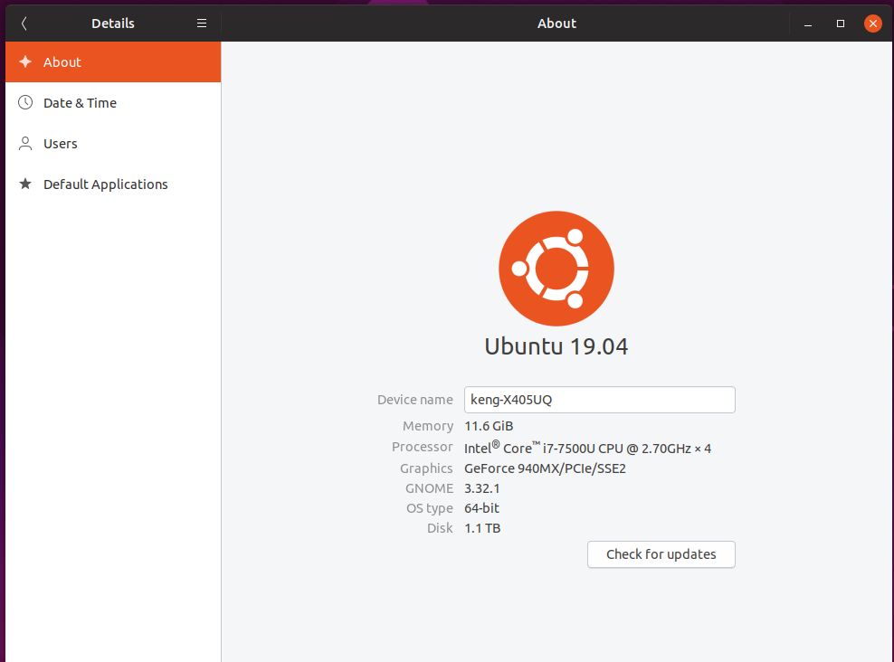

# Tensorflow2.0rc1
Building Tensorflow 2.0 RC 1 from source

## Purpose of Building from source
When a version of tensorflow is released, you can easily do a **pip3 install tensorflow-gpu==2.0.0rc1** to install the latest software. However, there is no source codes required, it's just a module install.  When Source codes of tensorflow is required, for example, the need to access TFliteconverter etc or when you need to have a better understanding of tensorflow codes, you might need to build from source.  However, it is very timeconsuming.  And after many hours, it might fail on some conditions. I am building this, because a foot note from tensorflow says if you want to delve into Converter Python converter, you need to [build from source](https://www.tensorflow.org/lite/convert/python_api#build_from_source_code_) and nobody is on UBUNTU 19.04 with CUDA 10.1 

Last week, Tensorflow released 2.0 RC1.  Here's my environment




## Building steps

### 1. Download BAZEL version 0.25 for build.  

```
cd ~/Downloads
wget https://github.com/bazelbuild/bazel/tags download bazel-0.25.2-installer-linux-x86_64.sh
./bazel-0.25.2-installer-linux-x86_64.sh --user

WARNING: --batch mode is deprecated. Please instead explicitly shut down your Bazel server using the command "bazel shutdown".
Build label: 0.25.2
Build target: bazel-out/k8-opt/bin/src/main/java/com/google/devtools/build/lib/bazel/BazelServer_deploy.jar
Build time: Fri May 10 20:47:48 2019 (1557521268)
Build timestamp: 1557521268
Build timestamp as int: 1557521268

```

Notes:  
1.  I normally go to ~/Downloads and do this wget. Then, when I am done with the file, I can remove them
2.  The latest version of BAZEL might not work.  The latest **doesn't** mean the greatest.  
3.  Specifically for 2.0rc1, I tested with **0.25.2** 

### 2. Install all pre-requisites

```
sudo apt-get install python-numpy [**not sure if I needed to do this or is pip3 install numpy good enough**]
sudo apt-get install -y make build-essential libssl-dev zlib1g-dev libbz2-dev libreadline-dev libsqlite3-dev wget curl llvm libncurses5-dev libncursesw5-dev xz-utils
```

Notes:
1.  numpy caused me some problems with .local version, pip3 install numpy version and this sudo apt-get install python-numpy
2.  In the end, my pip3 has numpy version **1.17.2** 
3.  Most of these packages have an init.py, which needed to be in PYTHONPATH.  So, place the right numpy path for python in the earlier sequence for the PYTHONPATH variable which I set in ~/.bashrc
4.  Another trick I do is this, get into python command line, do an **import numpy**, then check **numpy.\__file\__** which will display the path of the numpy used.  If import numpy hits a problem, don't proceed to bazel build as it will surely abend after step 11,000+

### 3. Download tf2 source codes

There are 2 methods of doing this. But do checkout the [latest release](https://github.com/tensorflow/tensorflow/releases) Then, go to the bottom of the [link](https://github.com/tensorflow/tensorflow/releases/tag/v2.0.0-rc1) and you can see the link to either source codes ( zip or tar.gz ) version.  I prefer to download the tar.gz version but either is fine


```
cd ~/Downloads
wget https://github.com/tensorflow/tensorflow/archive/v2.0.0-rc1.tar.gz
tar -xvf v2*.gz
[move the tensorflow directory to ~/]
```
Alternatively, you can **git clone https://github.com/tensorflow/tensorflow.git ** and do a **git checkout xxxxx** But then again, you will need to know the version to checkout.


### 4.  Configure

```
cd ~/tensorflow
./configure
```

Notes:
1.  set up python bin as **/usr/bin/python3**
2.  set up python library as **/usr/lib/python3.7** This step is very very important to get right. Otherwise, after the last step, import tensorflow as tf will just be silent.
3.  select **CUDA** - Then we will get a GPU built tensorflow


### 5.  Start the BUILD
```
bazel build --verbose_failures --config=cuda //tensorflow/tools/pip_package:build_pip_package &

INFO: Elapsed time: 28929.331s, Critical Path: 473.63s
INFO: 25004 processes: 25004 local.
INFO: Build completed successfully, 34536 total actions
```

Notes:
1.   The **&** generates a background job
2.   Wait for a long time till you see 34536 actions finnished.  It took around 5-6 hours 

### 6.   Convert into a WHL file  
```
./bazel-bin/tensorflow/tools/pip_package/build_pip_package tensorflow_pkg

Sat Sep 14 14:35:17 +08 2019 : === Preparing sources in dir: /tmp/tmp.vJA9nY1r7W
~/tensorflow ~/tensorflow
~/tensorflow
/tmp/tmp.vJA9nY1r7W/tensorflow/include ~/tensorflow
~/tensorflow
Sat Sep 14 14:35:32 +08 2019 : === Building wheel
warning: no files found matching '*.pyd' under directory '*'
warning: no files found matching '*.pd' under directory '*'
warning: no files found matching '*.dylib' under directory '*'
warning: no files found matching '*.dll' under directory '*'
warning: no files found matching '*.lib' under directory '*'
warning: no files found matching '*.csv' under directory '*'
warning: no files found matching '*.h' under directory 'tensorflow_core/include/tensorflow'
warning: no files found matching '*' under directory 'tensorflow_core/include/third_party'
Sat Sep 14 14:36:12 +08 2019 : === Output wheel file is in: /home/keng/tensorflow/tensorflow_pkg

```
Notes:
1.   This conversion is very fast, taking 2 minutes.

### 7.  pip3 install whl
```
pip3 install tensorflow_pkg/tensorflow*

Requirement already satisfied: tensorflow==2.0.0rc1 from file:///home/keng/tensorflow/tensorflow_pkg/tensorflow-2.0.0rc1-cp37-cp37m-linux_x86_64.whl in /home/keng/.local/lib/python3.7/site-packages (2.0.0rc1)
Requirement already satisfied: six>=1.10.0 in /usr/lib/python3/dist-packages (from tensorflow==2.0.0rc1) (1.12.0)
Requirement already satisfied: termcolor>=1.1.0 in /home/keng/.local/lib/python3.7/site-packages (from tensorflow==2.0.0rc1) (1.1.0)
Requirement already satisfied: grpcio>=1.8.6 in /home/keng/.local/lib/python3.7/site-packages (from tensorflow==2.0.0rc1) (1.22.0)
Collecting wrapt>=1.11.1 (from tensorflow==2.0.0rc1)
  Downloading https://files.pythonhosted.org/packages/23/84/323c2415280bc4fc880ac5050dddfb3c8062c2552b34c2e512eb4aa68f79/wrapt-1.11.2.tar.gz
Requirement already satisfied: keras-applications>=1.0.8 in /home/keng/.local/lib/python3.7/site-packages (from tensorflow==2.0.0rc1) (1.0.8)
Requirement already satisfied: gast==0.2.2 in /home/keng/.local/lib/python3.7/site-packages (from tensorflow==2.0.0rc1) (0.2.2)
Requirement already satisfied: tf-estimator-nightly<1.14.0.dev2019080602,>=1.14.0.dev2019080601 in /home/keng/.local/lib/python3.7/site-packages (from tensorflow==2.0.0rc1) (1.14.0.dev2019080601)
Requirement already satisfied: astor>=0.6.0 in /home/keng/.local/lib/python3.7/site-packages (from tensorflow==2.0.0rc1) (0.8.0)
Requirement already satisfied: absl-py>=0.7.0 in /home/keng/.local/lib/python3.7/site-packages (from tensorflow==2.0.0rc1) (0.7.1)
Requirement already satisfied: opt-einsum>=2.3.2 in /home/keng/.local/lib/python3.7/site-packages (from tensorflow==2.0.0rc1) (3.0.1)
Requirement already satisfied: keras-preprocessing>=1.0.5 in /home/keng/.local/lib/python3.7/site-packages (from tensorflow==2.0.0rc1) (1.1.0)
Requirement already satisfied: numpy<2.0,>=1.16.0 in /usr/lib/python3/dist-packages (from tensorflow==2.0.0rc1) (1.16.2)
Requirement already satisfied: wheel>=0.26 in /usr/lib/python3/dist-packages (from tensorflow==2.0.0rc1) (0.32.3)
Requirement already satisfied: protobuf>=3.6.1 in /usr/lib/python3/dist-packages (from tensorflow==2.0.0rc1) (3.6.1)
Requirement already satisfied: google-pasta>=0.1.6 in /home/keng/.local/lib/python3.7/site-packages (from tensorflow==2.0.0rc1) (0.1.7)
Requirement already satisfied: tb-nightly<1.15.0a20190807,>=1.15.0a20190806 in /home/keng/.local/lib/python3.7/site-packages (from tensorflow==2.0.0rc1) (1.15.0a20190806)
Requirement already satisfied: h5py in /home/keng/.local/lib/python3.7/site-packages (from keras-applications>=1.0.8->tensorflow==2.0.0rc1) (2.9.0)
Requirement already satisfied: werkzeug>=0.11.15 in /home/keng/.local/lib/python3.7/site-packages (from tb-nightly<1.15.0a20190807,>=1.15.0a20190806->tensorflow==2.0.0rc1) (0.15.5)
Collecting setuptools>=41.0.0 (from tb-nightly<1.15.0a20190807,>=1.15.0a20190806->tensorflow==2.0.0rc1)
  Downloading https://files.pythonhosted.org/packages/b2/86/095d2f7829badc207c893dd4ac767e871f6cd547145df797ea26baea4e2e/setuptools-41.2.0-py2.py3-none-any.whl (576kB)
    100% |████████████████████████████████| 583kB 2.8MB/s 
Requirement already satisfied: markdown>=2.6.8 in /home/keng/.local/lib/python3.7/site-packages (from tb-nightly<1.15.0a20190807,>=1.15.0a20190806->tensorflow==2.0.0rc1) (3.1.1)
Building wheels for collected packages: wrapt
  Running setup.py bdist_wheel for wrapt ... done
  Stored in directory: /home/keng/.cache/pip/wheels/d7/de/2e/efa132238792efb6459a96e85916ef8597fcb3d2ae51590dfd
Successfully built wrapt
launchpadlib 1.10.6 requires testresources, which is not installed.
pycocotools 2.0 requires cython>=0.27.3, which is not installed.
Installing collected packages: wrapt, setuptools
Successfully installed setuptools-41.2.0 wrapt-1.11.2
```
### 8. Test out the sample code which was from https://www.tensorflow.org/beta/tutorials/images/intro_to_cnns
```
pip3 test-tf2-cnn.py

2019-09-14 14:44:51.092517: I tensorflow/stream_executor/platform/default/dso_loader.cc:44] Successfully opened dynamic library libcuda.so.1
2019-09-14 14:44:51.105878: I tensorflow/stream_executor/cuda/cuda_gpu_executor.cc:1006] successful NUMA node read from SysFS had negative value (-1), but there must be at least one NUMA node, so returning NUMA node zero
2019-09-14 14:44:51.106789: I tensorflow/core/common_runtime/gpu/gpu_device.cc:1618] Found device 0 with properties: 
name: GeForce 940MX major: 5 minor: 0 memoryClockRate(GHz): 1.189
pciBusID: 0000:01:00.0
2019-09-14 14:44:51.106946: I tensorflow/stream_executor/platform/default/dso_loader.cc:44] Successfully opened dynamic library libcudart.so.10.0
2019-09-14 14:44:51.107763: I tensorflow/stream_executor/platform/default/dso_loader.cc:44] Successfully opened dynamic library libcublas.so.10.0
2019-09-14 14:44:51.108486: I tensorflow/stream_executor/platform/default/dso_loader.cc:44] Successfully opened dynamic library libcufft.so.10.0
2019-09-14 14:44:51.108678: I tensorflow/stream_executor/platform/default/dso_loader.cc:44] Successfully opened dynamic library libcurand.so.10.0
2019-09-14 14:44:51.109755: I tensorflow/stream_executor/platform/default/dso_loader.cc:44] Successfully opened dynamic library libcusolver.so.10.0
2019-09-14 14:44:51.110618: I tensorflow/stream_executor/platform/default/dso_loader.cc:44] Successfully opened dynamic library libcusparse.so.10.0
2019-09-14 14:44:51.113464: I tensorflow/stream_executor/platform/default/dso_loader.cc:44] Successfully opened dynamic library libcudnn.so.7
2019-09-14 14:44:51.113604: I tensorflow/stream_executor/cuda/cuda_gpu_executor.cc:1006] successful NUMA node read from SysFS had negative value (-1), but there must be at least one NUMA node, so returning NUMA node zero
2019-09-14 14:44:51.114850: I tensorflow/stream_executor/cuda/cuda_gpu_executor.cc:1006] successful NUMA node read from SysFS had negative value (-1), but there must be at least one NUMA node, so returning NUMA node zero
2019-09-14 14:44:51.115750: I tensorflow/core/common_runtime/gpu/gpu_device.cc:1746] Adding visible gpu devices: 0
2019-09-14 14:44:51.115977: I tensorflow/core/platform/cpu_feature_guard.cc:142] Your CPU supports instructions that this TensorFlow binary was not compiled to use: SSE4.1 SSE4.2 AVX AVX2 FMA
2019-09-14 14:44:51.138219: I tensorflow/core/platform/profile_utils/cpu_utils.cc:94] CPU Frequency: 2904000000 Hz
2019-09-14 14:44:51.138489: I tensorflow/compiler/xla/service/service.cc:168] XLA service 0x3bbf7f0 executing computations on platform Host. Devices:
2019-09-14 14:44:51.138506: I tensorflow/compiler/xla/service/service.cc:175]   StreamExecutor device (0): Host, Default Version
2019-09-14 14:44:51.138699: I tensorflow/stream_executor/cuda/cuda_gpu_executor.cc:1006] successful NUMA node read from SysFS had negative value (-1), but there must be at least one NUMA node, so returning NUMA node zero
2019-09-14 14:44:51.142264: I tensorflow/core/common_runtime/gpu/gpu_device.cc:1618] Found device 0 with properties: 
name: GeForce 940MX major: 5 minor: 0 memoryClockRate(GHz): 1.189
pciBusID: 0000:01:00.0
2019-09-14 14:44:51.142309: I tensorflow/stream_executor/platform/default/dso_loader.cc:44] Successfully opened dynamic library libcudart.so.10.0
2019-09-14 14:44:51.142323: I tensorflow/stream_executor/platform/default/dso_loader.cc:44] Successfully opened dynamic library libcublas.so.10.0
2019-09-14 14:44:51.142336: I tensorflow/stream_executor/platform/default/dso_loader.cc:44] Successfully opened dynamic library libcufft.so.10.0
2019-09-14 14:44:51.142348: I tensorflow/stream_executor/platform/default/dso_loader.cc:44] Successfully opened dynamic library libcurand.so.10.0
2019-09-14 14:44:51.142361: I tensorflow/stream_executor/platform/default/dso_loader.cc:44] Successfully opened dynamic library libcusolver.so.10.0
2019-09-14 14:44:51.142373: I tensorflow/stream_executor/platform/default/dso_loader.cc:44] Successfully opened dynamic library libcusparse.so.10.0
2019-09-14 14:44:51.142385: I tensorflow/stream_executor/platform/default/dso_loader.cc:44] Successfully opened dynamic library libcudnn.so.7
2019-09-14 14:44:51.142437: I tensorflow/stream_executor/cuda/cuda_gpu_executor.cc:1006] successful NUMA node read from SysFS had negative value (-1), but there must be at least one NUMA node, so returning NUMA node zero
2019-09-14 14:44:51.143265: I tensorflow/stream_executor/cuda/cuda_gpu_executor.cc:1006] successful NUMA node read from SysFS had negative value (-1), but there must be at least one NUMA node, so returning NUMA node zero
2019-09-14 14:44:51.144022: I tensorflow/core/common_runtime/gpu/gpu_device.cc:1746] Adding visible gpu devices: 0
2019-09-14 14:44:51.144049: I tensorflow/stream_executor/platform/default/dso_loader.cc:44] Successfully opened dynamic library libcudart.so.10.0
2019-09-14 14:44:51.188895: I tensorflow/core/common_runtime/gpu/gpu_device.cc:1159] Device interconnect StreamExecutor with strength 1 edge matrix:
2019-09-14 14:44:51.188918: I tensorflow/core/common_runtime/gpu/gpu_device.cc:1165]      0 
2019-09-14 14:44:51.188950: I tensorflow/core/common_runtime/gpu/gpu_device.cc:1178] 0:   N 
2019-09-14 14:44:51.189195: I tensorflow/stream_executor/cuda/cuda_gpu_executor.cc:1006] successful NUMA node read from SysFS had negative value (-1), but there must be at least one NUMA node, so returning NUMA node zero
2019-09-14 14:44:51.189843: I tensorflow/stream_executor/cuda/cuda_gpu_executor.cc:1006] successful NUMA node read from SysFS had negative value (-1), but there must be at least one NUMA node, so returning NUMA node zero
2019-09-14 14:44:51.190494: I tensorflow/stream_executor/cuda/cuda_gpu_executor.cc:1006] successful NUMA node read from SysFS had negative value (-1), but there must be at least one NUMA node, so returning NUMA node zero
2019-09-14 14:44:51.191115: I tensorflow/core/common_runtime/gpu/gpu_device.cc:1304] Created TensorFlow device (/job:localhost/replica:0/task:0/device:GPU:0 with 1469 MB memory) -> physical GPU (device: 0, name: GeForce 940MX, pci bus id: 0000:01:00.0, compute capability: 5.0)
2019-09-14 14:44:51.192629: I tensorflow/compiler/xla/service/service.cc:168] XLA service 0x4aebba0 executing computations on platform CUDA. Devices:
2019-09-14 14:44:51.192655: I tensorflow/compiler/xla/service/service.cc:175]   StreamExecutor device (0): GeForce 940MX, Compute Capability 5.0
Model: "sequential"
_________________________________________________________________
Layer (type)                 Output Shape              Param #   
=================================================================
conv2d (Conv2D)              (None, 26, 26, 32)        320       
_________________________________________________________________
max_pooling2d (MaxPooling2D) (None, 13, 13, 32)        0         
_________________________________________________________________
conv2d_1 (Conv2D)            (None, 11, 11, 64)        18496     
_________________________________________________________________
max_pooling2d_1 (MaxPooling2 (None, 5, 5, 64)          0         
_________________________________________________________________
conv2d_2 (Conv2D)            (None, 3, 3, 64)          36928     
=================================================================
Total params: 55,744
Trainable params: 55,744
Non-trainable params: 0
_________________________________________________________________
2019-09-14 14:44:51.775151: W tensorflow/core/framework/cpu_allocator_impl.cc:81] Allocation of 376320000 exceeds 10% of system memory.
Train on 60000 samples
Epoch 1/5
2019-09-14 14:44:52.362913: I tensorflow/stream_executor/platform/default/dso_loader.cc:44] Successfully opened dynamic library libcublas.so.10.0
2019-09-14 14:44:54.343499: I tensorflow/stream_executor/platform/default/dso_loader.cc:44] Successfully opened dynamic library libcudnn.so.7
60000/60000 [==============================] - 23s 378us/sample - loss: 0.1515 - accuracy: 0.9528
Epoch 2/5
60000/60000 [==============================] - 13s 210us/sample - loss: 0.0481 - accuracy: 0.9850
Epoch 3/5
60000/60000 [==============================] - 13s 210us/sample - loss: 0.0337 - accuracy: 0.9893
Epoch 4/5
60000/60000 [==============================] - 13s 209us/sample - loss: 0.0259 - accuracy: 0.9918
Epoch 5/5
60000/60000 [==============================] - 13s 209us/sample - loss: 0.0202 - accuracy: 0.9937
10000/1 - 1s 103us/sample - loss: 0.0197 - accuracy: 0.9902
0.9902

```
Notes:
1.  The speed for the execution is quite impressive. I am on CUDA 10.1
2.  Now, what I need to do is to wait for the **bleeding edge** guys to test out the tflite converter and uncover some bugs rather than banging my head on unit testing.  Then when the coast is clear, I can then try FLUTTER to move my trained object detector onto an Andriod and an IPHONE app.
3.  There should still be some issues with all the codes out there since some functions of TF 1.4 is **depreciated** I wonder why a simpler word **removed** wasn't used.  Anyway, it's a nice exercise to do this routine.  And always good to learn abit of systems debugging stuff around my numpy issues before the built. 

